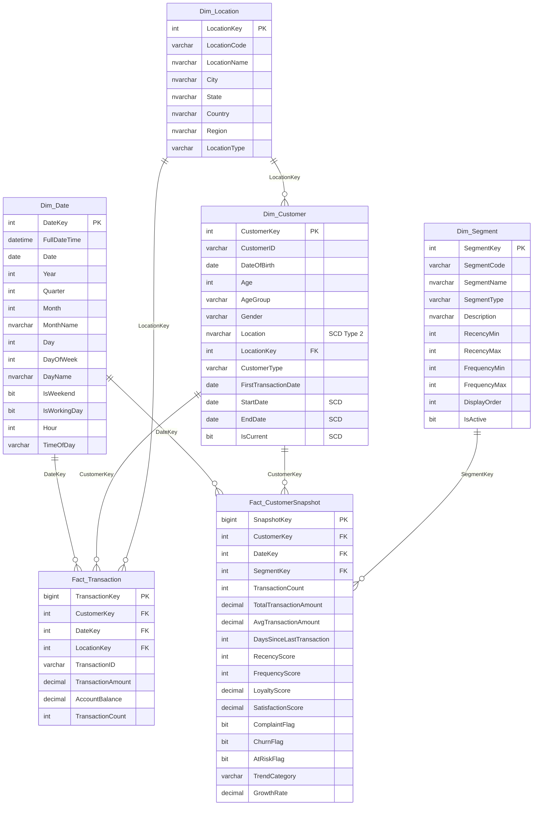
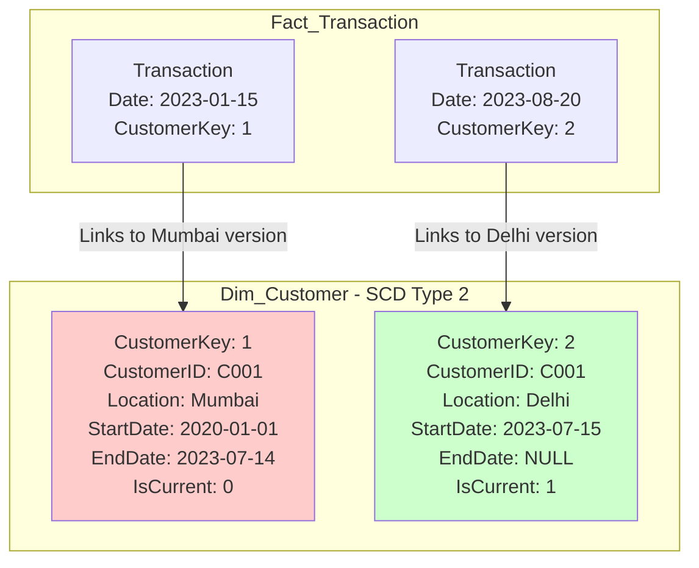
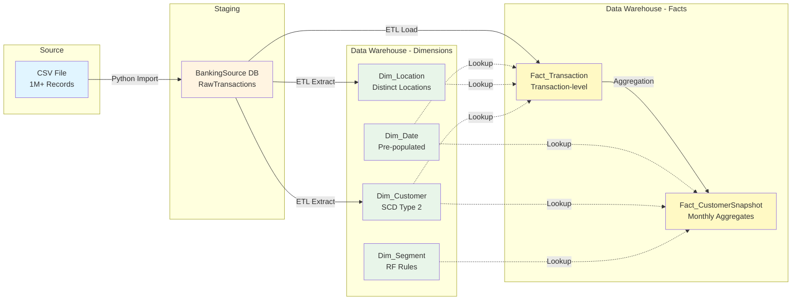
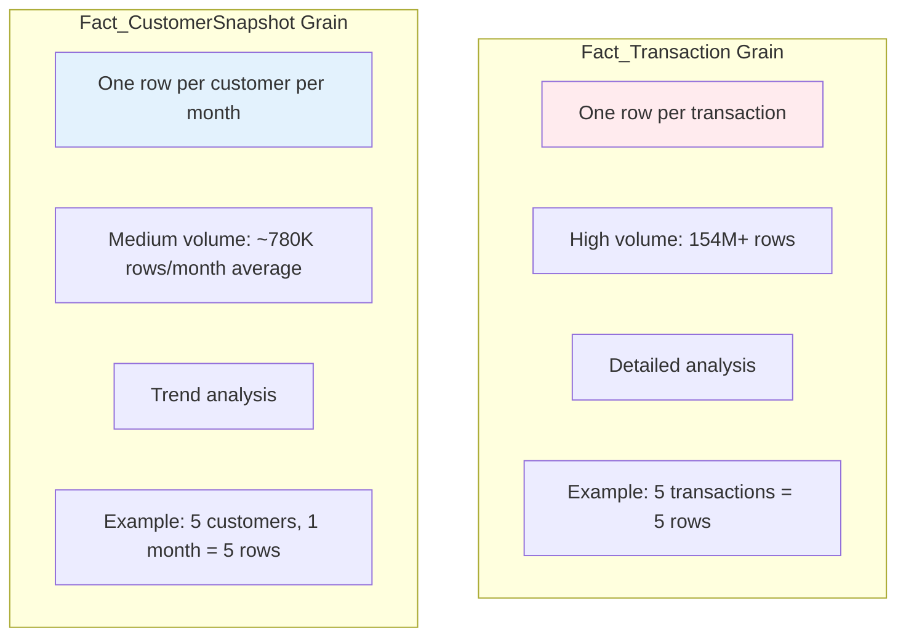
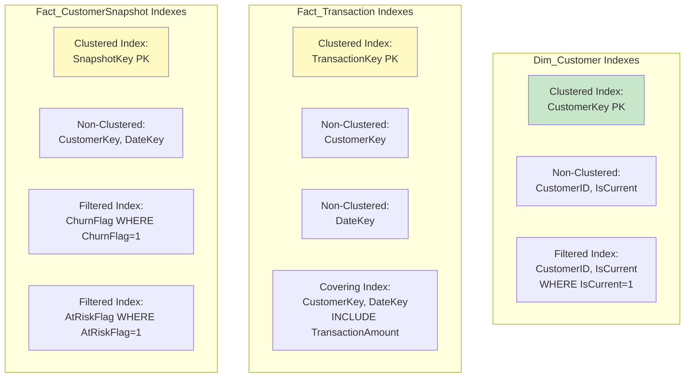
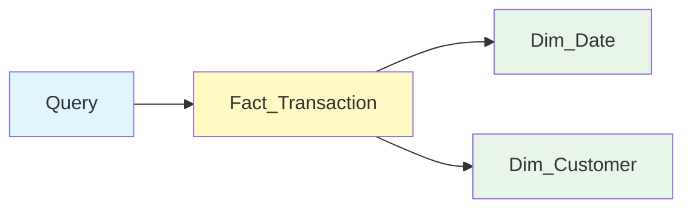
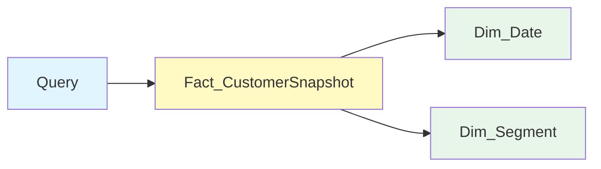
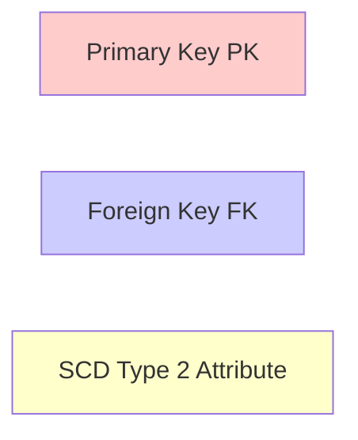

# Entity Relationship Diagram
## Banking Customer Loyalty & Churn Analysis Data Warehouse

---

## Star Schema Overview



---

## Detailed Relationship Descriptions

### 1. Dim_Date Relationships

**To Fact_Transaction:**
- **Cardinality:** 1:Many
- **Description:** One date can have many transactions
- **Join:** `Fact_Transaction.DateKey = Dim_Date.DateKey`

**To Fact_CustomerSnapshot:**
- **Cardinality:** 1:Many
- **Description:** One date (end of month) can have many customer snapshots
- **Join:** `Fact_CustomerSnapshot.DateKey = Dim_Date.DateKey`

---

### 2. Dim_Customer Relationships

**To Fact_Transaction:**
- **Cardinality:** 1:Many (with SCD Type 2 consideration)
- **Description:** One customer version can have many transactions
- **Join:** `Fact_Transaction.CustomerKey = Dim_Customer.CustomerKey`
- **Special Note:** Must join based on transaction date falling within StartDate and EndDate

**To Fact_CustomerSnapshot:**
- **Cardinality:** 1:Many
- **Description:** One customer (current version) can have many monthly snapshots
- **Join:** `Fact_CustomerSnapshot.CustomerKey = Dim_Customer.CustomerKey WHERE IsCurrent = 1`

---

### 3. Dim_Location Relationships

**To Dim_Customer:**
- **Cardinality:** 1:Many
- **Description:** One location can have many customers (or customer versions)
- **Join:** `Dim_Customer.LocationKey = Dim_Location.LocationKey`

**To Fact_Transaction:**
- **Cardinality:** 1:Many
- **Description:** One location can have many transactions
- **Join:** `Fact_Transaction.LocationKey = Dim_Location.LocationKey`

---

### 4. Dim_Segment Relationships

**To Fact_CustomerSnapshot:**
- **Cardinality:** 1:Many
- **Description:** One segment can classify many customer snapshots
- **Join:** `Fact_CustomerSnapshot.SegmentKey = Dim_Segment.SegmentKey`

---

## SCD Type 2 Relationship (Dim_Customer)

### Visual Representation



### How SCD Type 2 Works

**Scenario:** Customer C001 moves from Mumbai to Delhi on 2023-07-15

**Before Move:**
```
CustomerKey | CustomerID | Location | StartDate  | EndDate | IsCurrent
1           | C001       | Mumbai   | 2020-01-01 | NULL    | 1
```

**After Move:**
```
CustomerKey | CustomerID | Location | StartDate  | EndDate    | IsCurrent
1           | C001       | Mumbai   | 2020-01-01 | 2023-07-14 | 0  ← Historical
2           | C001       | Delhi    | 2023-07-15 | NULL       | 1  ← Current
```

**Transaction Linking:**
- Transactions before 2023-07-15 → Link to CustomerKey=1 (Mumbai)
- Transactions after 2023-07-15 → Link to CustomerKey=2 (Delhi)

**SQL Join Pattern:**
```sql
SELECT *
FROM Fact_Transaction F
JOIN Dim_Customer C ON F.CustomerKey = C.CustomerKey
WHERE C.CustomerID = 'C001'
  AND F.TransactionDate BETWEEN C.StartDate AND ISNULL(C.EndDate, '9999-12-31')
```

---

## Data Flow Diagram



---

## Fact Table Grain Comparison



---

## Index Strategy Visualization



---

## Query Pattern Examples

### Pattern 1: Simple Dimension Lookup



**SQL:**
```sql
SELECT 
    D.MonthName,
    C.AgeGroup,
    SUM(F.TransactionAmount) AS Total
FROM Fact_Transaction F
JOIN Dim_Date D ON F.DateKey = D.DateKey
JOIN Dim_Customer C ON F.CustomerKey = C.CustomerKey
WHERE D.Year = 2016
GROUP BY D.MonthName, C.AgeGroup;
```

---

### Pattern 2: Snapshot Trend Analysis



**SQL:**
```sql
SELECT 
    D.YearMonth,
    S.SegmentName,
    AVG(F.LoyaltyScore) AS AvgLoyalty,
    COUNT(DISTINCT F.CustomerKey) AS CustomerCount
FROM Fact_CustomerSnapshot F
JOIN Dim_Date D ON F.DateKey = D.DateKey
JOIN Dim_Segment S ON F.SegmentKey = S.SegmentKey
GROUP BY D.YearMonth, S.SegmentName
ORDER BY D.YearMonth;
```

---

## Cardinality Summary

| Relationship | Cardinality | Description |
|--------------|-------------|-------------|
| Dim_Date → Fact_Transaction | 1:Many | One date, many transactions |
| Dim_Date → Fact_CustomerSnapshot | 1:Many | One month-end date, many snapshots |
| Dim_Customer → Fact_Transaction | 1:Many | One customer version, many transactions |
| Dim_Customer → Fact_CustomerSnapshot | 1:Many | One customer, many monthly snapshots |
| Dim_Location → Fact_Transaction | 1:Many | One location, many transactions |
| Dim_Location → Dim_Customer | 1:Many | One location, many customers |
| Dim_Segment → Fact_CustomerSnapshot | 1:Many | One segment, many customer-months |

---
## Actual Data Volumes (As of December 2025)

| Table | Rows Loaded | Date Range | Source |
|-------|-------------|------------|--------|
| Dim_Date | 5,844 | 2015-2030 | Pre-populated |
| Dim_Location | 9,021 | - | Package 2 |
| Dim_Customer | 884,265 | - | Package 3 |
| Dim_Segment | 7 | - | Pre-populated |
| Fact_Transaction | 154,777,534 | 2015-01 to 2016-08 | Package 4 |
| Fact_CustomerSnapshot | 15,581,079 | 2015-01 to 2016-08 | Package 5 |

**Total DW Size:** ~17 GB (including indexes)

---

## Referential Integrity

All relationships are enforced through:
- ✅ Foreign Key Constraints (at database level)
- ✅ ETL Lookup Transformations (in SSIS)
- ✅ NULL handling for optional relationships

**Cascading Rules:**
- No CASCADE DELETE (data warehouse principle: never delete facts)
- No CASCADE UPDATE on surrogate keys
- Orphan prevention through ETL validation

---

## Legend



---

**Document Version:** 1.1  
**Last Updated:** December 2025  
**Tool:** Mermaid.js  

**Implementation Status:**
- ✅ Physical Schema: Created (Phase 2)
- ✅ Data Loaded: All tables populated (Phase 5)
  - Dim_Date: 5,844 rows
  - Dim_Location: 9,021 rows
  - Dim_Customer: 884,265 rows (SCD Type 2 ready)
  - Dim_Segment: 7 segments
  - Fact_Transaction: 154,777,534 rows
  - Fact_CustomerSnapshot: 15,581,079 rows

**GitHub Rendering:** Automatic via Mermaid.js
