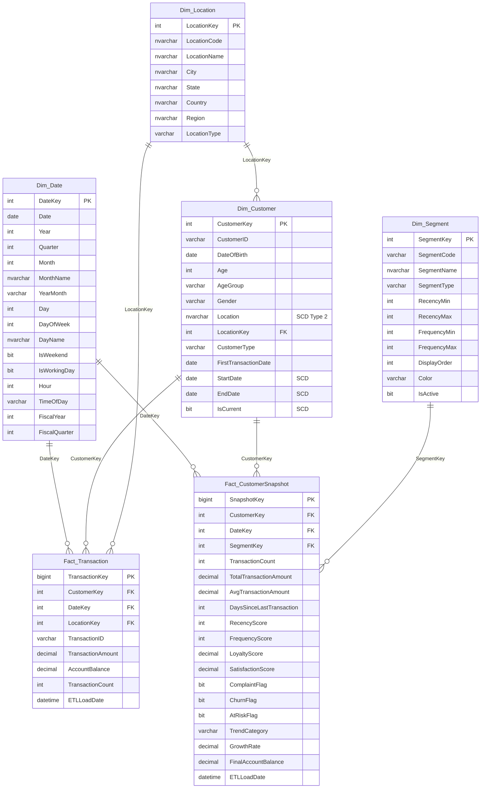
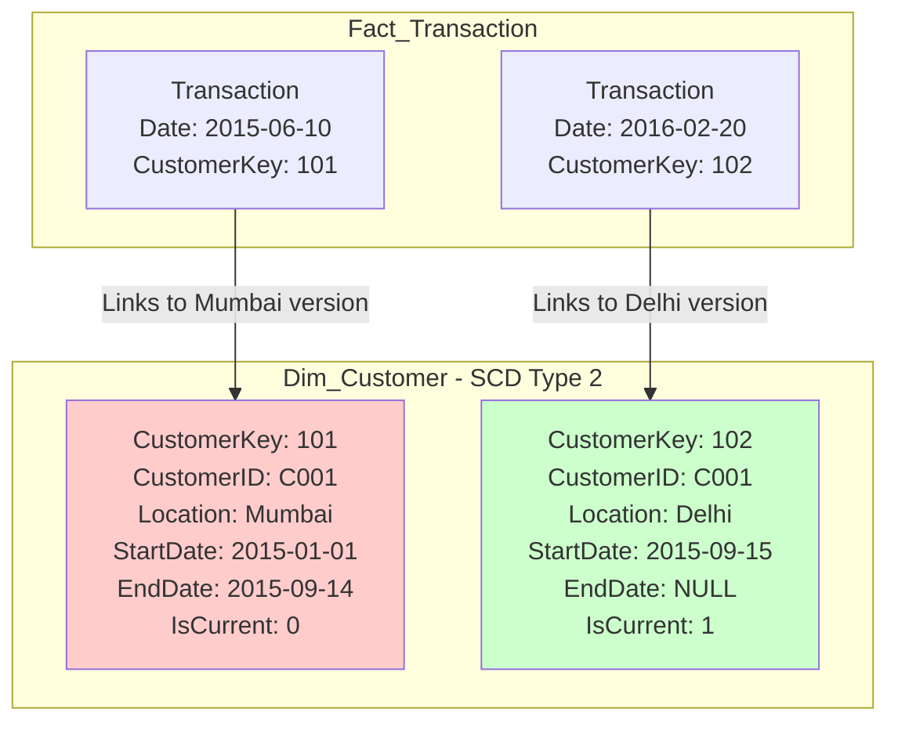
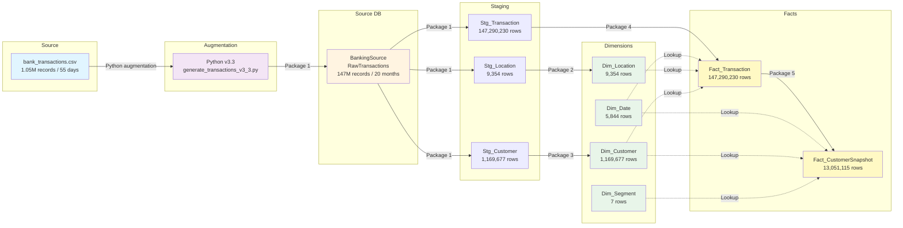

# Entity Relationship Diagram
## Banking Customer Loyalty & Churn Analysis Data Warehouse

---

## Star Schema Overview

```mermaid
erDiagram
    Dim_Date ||--o{ Fact_Transaction : "DateKey"
    Dim_Date ||--o{ Fact_CustomerSnapshot : "DateKey"
    
    Dim_Customer ||--o{ Fact_Transaction : "CustomerKey"
    Dim_Customer ||--o{ Fact_CustomerSnapshot : "CustomerKey"
    
    Dim_Location ||--o{ Fact_Transaction : "LocationKey"
    Dim_Location ||--o{ Dim_Customer : "LocationKey"
    
    Dim_Segment ||--o{ Fact_CustomerSnapshot : "SegmentKey"

    Dim_Date {
        int DateKey PK
        date Date
        int Year
        int Quarter
        int Month
        nvarchar MonthName
        varchar YearMonth
        int Day
        int DayOfWeek
        nvarchar DayName
        bit IsWeekend
        bit IsWorkingDay
        int Hour
        varchar TimeOfDay
        int FiscalYear
        int FiscalQuarter
    }

    Dim_Customer {
        int CustomerKey PK
        varchar CustomerID
        date DateOfBirth
        int Age
        varchar AgeGroup
        varchar Gender
        nvarchar Location "SCD Type 2"
        int LocationKey FK
        varchar CustomerType
        date FirstTransactionDate
        date StartDate "SCD"
        date EndDate "SCD"
        bit IsCurrent "SCD"
    }

    Dim_Location {
        int LocationKey PK
        nvarchar LocationCode
        nvarchar LocationName
        nvarchar City
        nvarchar State
        nvarchar Country
        nvarchar Region
        varchar LocationType
    }

    Dim_Segment {
        int SegmentKey PK
        varchar SegmentCode
        nvarchar SegmentName
        varchar SegmentType
        int RecencyMin
        int RecencyMax
        int FrequencyMin
        int FrequencyMax
        int DisplayOrder
        varchar Color
        bit IsActive
    }

    Fact_Transaction {
        bigint TransactionKey PK
        int CustomerKey FK
        int DateKey FK
        int LocationKey FK
        varchar TransactionID
        decimal TransactionAmount
        decimal AccountBalance
        int TransactionCount
        datetime ETLLoadDate
    }

    Fact_CustomerSnapshot {
        bigint SnapshotKey PK
        int CustomerKey FK
        int DateKey FK
        int SegmentKey FK
        int TransactionCount
        decimal TotalTransactionAmount
        decimal AvgTransactionAmount
        int DaysSinceLastTransaction
        int RecencyScore
        int FrequencyScore
        decimal LoyaltyScore
        decimal SatisfactionScore
        bit ComplaintFlag
        bit ChurnFlag
        bit AtRiskFlag
        varchar TrendCategory
        decimal GrowthRate
        decimal FinalAccountBalance
        datetime ETLLoadDate
    }
```

---

## Detailed Relationship Descriptions

### 1. Dim_Date Relationships

**To Fact_Transaction:**
- **Cardinality:** 1:Many
- **Join:** `Fact_Transaction.DateKey = Dim_Date.DateKey`

**To Fact_CustomerSnapshot:**
- **Cardinality:** 1:Many
- **Join:** `Fact_CustomerSnapshot.DateKey = Dim_Date.DateKey`
- **Note:** DateKey in snapshot always points to last day of month (EOMONTH)

---

### 2. Dim_Customer Relationships

**To Fact_Transaction:**
- **Cardinality:** 1:Many (SCD Type 2 aware)
- **Join:** `Fact_Transaction.CustomerKey = Dim_Customer.CustomerKey`
- **Special Note:** CustomerKey resolved at ETL time by matching `(CustomerID, Location)` — ensures each transaction links to the correct customer version

**To Fact_CustomerSnapshot:**
- **Cardinality:** 1:Many
- **Join:** `Fact_CustomerSnapshot.CustomerKey = Dim_Customer.CustomerKey WHERE IsCurrent = 1`

---

### 3. Dim_Location Relationships

**To Dim_Customer:**
- **Cardinality:** 1:Many
- **Join:** `Dim_Customer.LocationKey = Dim_Location.LocationKey`

**To Fact_Transaction:**
- **Cardinality:** 1:Many
- **Join:** `Fact_Transaction.LocationKey = Dim_Location.LocationKey`

---

### 4. Dim_Segment Relationships

**To Fact_CustomerSnapshot:**
- **Cardinality:** 1:Many
- **Join:** `Fact_CustomerSnapshot.SegmentKey = Dim_Segment.SegmentKey`
- **Assignment Logic:** DaysSinceLastTransaction BETWEEN RecencyMin AND RecencyMax AND TransactionCount BETWEEN FrequencyMin AND FrequencyMax

---

## SCD Type 2 Relationship (Dim_Customer)

```mermaid
graph TB
    subgraph "Dim_Customer - SCD Type 2"
        C1["CustomerKey: 101<br/>CustomerID: C001<br/>Location: Mumbai<br/>StartDate: 2015-01-01<br/>EndDate: 2015-09-14<br/>IsCurrent: 0"]
        C2["CustomerKey: 102<br/>CustomerID: C001<br/>Location: Delhi<br/>StartDate: 2015-09-15<br/>EndDate: NULL<br/>IsCurrent: 1"]
    end
    
    subgraph "Fact_Transaction"
        T1["Transaction<br/>Date: 2015-06-10<br/>CustomerKey: 101"]
        T2["Transaction<br/>Date: 2016-02-20<br/>CustomerKey: 102"]
    end
    
    T1 -->|Links to Mumbai version| C1
    T2 -->|Links to Delhi version| C2

    style C1 fill:#ffcccc
    style C2 fill:#ccffcc
```

**Actual SCD Volume (Jun 2026):**
- Total rows: 1,169,677
- Current versions: 884,225
- Historical versions: 285,452
- Customers who changed location: 243,376

---

## Data Flow Diagram

```mermaid
graph LR
    subgraph "Source"
        S1[bank_transactions.csv<br/>1.05M records / 55 days]
    end
    
    subgraph "Augmentation"
        PY[Python v3.3<br/>generate_transactions_v3_3.py]
    end

    subgraph "Source DB"
        ST0[BankingSource<br/>RawTransactions<br/>147M records / 20 months]
    end
    
    subgraph "Staging"
        ST1[Stg_Customer<br/>1,169,677 rows]
        ST2[Stg_Transaction<br/>147,290,230 rows]
        ST3[Stg_Location<br/>9,354 rows]
    end
    
    subgraph "Dimensions"
        D1[Dim_Date<br/>5,844 rows]
        D2[Dim_Location<br/>9,354 rows]
        D3[Dim_Customer<br/>1,169,677 rows]
        D4[Dim_Segment<br/>7 rows]
    end
    
    subgraph "Facts"
        F1[Fact_Transaction<br/>147,290,230 rows]
        F2[Fact_CustomerSnapshot<br/>13,051,115 rows]
    end
    
    S1 -->|Python augmentation| PY
    PY -->|Package 1| ST0
    ST0 -->|Package 1| ST1
    ST0 -->|Package 1| ST2
    ST0 -->|Package 1| ST3
    ST3 -->|Package 2| D2
    ST1 -->|Package 3| D3
    ST2 -->|Package 4| F1
    F1  -->|Package 5| F2
    
    D1 -.->|Lookup| F1
    D2 -.->|Lookup| F1
    D3 -.->|Lookup| F1
    D1 -.->|Lookup| F2
    D3 -.->|Lookup| F2
    D4 -.->|Lookup| F2

    style S1 fill:#e1f5ff
    style PY fill:#f3e5f5
    style ST0 fill:#fff4e1
    style D1 fill:#e8f5e9
    style D2 fill:#e8f5e9
    style D3 fill:#e8f5e9
    style D4 fill:#e8f5e9
    style F1 fill:#fff9c4
    style F2 fill:#fff9c4
```

---

## Fact Table Grain Comparison

| | Fact_Transaction | Fact_CustomerSnapshot |
|---|---|---|
| Grain | One row per transaction | One row per customer per month |
| Volume | 147,290,230 rows | 13,051,115 rows |
| Use Case | Transaction-level drill-down | Trend & segment analysis |
| Date Range | 2015-01-01 to 2016-08-31 | 2015-01-31 to 2016-08-31 |
| Load Method | SP + SSIS Package 4 | SP pipeline × 5 + Package 5 |
| Load Time | 00:24:09 | 00:10:02 |

---

## Cardinality Summary

| Relationship | Cardinality | Description |
|--------------|-------------|-------------|
| Dim_Date → Fact_Transaction | 1:Many | One date, many transactions |
| Dim_Date → Fact_CustomerSnapshot | 1:Many | One month-end date, many snapshots |
| Dim_Customer → Fact_Transaction | 1:Many | One customer version, many transactions |
| Dim_Customer → Fact_CustomerSnapshot | 1:Many | One customer, many monthly snapshots |
| Dim_Location → Fact_Transaction | 1:Many | One location, many transactions |
| Dim_Location → Dim_Customer | 1:Many | One location, many customer versions |
| Dim_Segment → Fact_CustomerSnapshot | 1:Many | One segment, many customer-months |

---

## Actual Data Volumes (Jun 2026)

| Table | Rows (Actual) | Date Range | Load Method |
|-------|--------------|------------|-------------|
| Dim_Date | 5,844 | 2015–2030 | Pre-populated |
| Dim_Location | 9,354 | — | Package 2 |
| Dim_Customer (Total) | 1,169,677 | — | Package 3 |
| Dim_Customer (Current) | 884,225 | — | Package 3 |
| Dim_Segment | 7 | — | Pre-populated |
| Fact_Transaction | 147,290,230 | 2015-01-01 to 2016-08-31 | Package 4 |
| Fact_CustomerSnapshot | 13,051,115 | 2015-01-31 to 2016-08-31 | Package 5 |

---

## Referential Integrity

All relationships enforced through:
- ✅ Foreign Key Constraints at database level
- ✅ ETL dependency ordering (Dims before Facts)
- ✅ NULL handling for optional relationships (LocationKey)

**Cascading Rules:**
- No CASCADE DELETE (data warehouse principle: never delete facts)
- No CASCADE UPDATE on surrogate keys

---

**Document Version:** 1.2
**Last Updated:** June 2026
**Tool:** Mermaid.js

**Implementation Status:**
- ✅ Phase 2: Physical schema created
- ✅ Phase 5: ETL complete — all packages executed and verified
- ✅ Phase 6: SSAS Tabular model
- ⏳ Phase 7: Power BI Dashboards (next)
